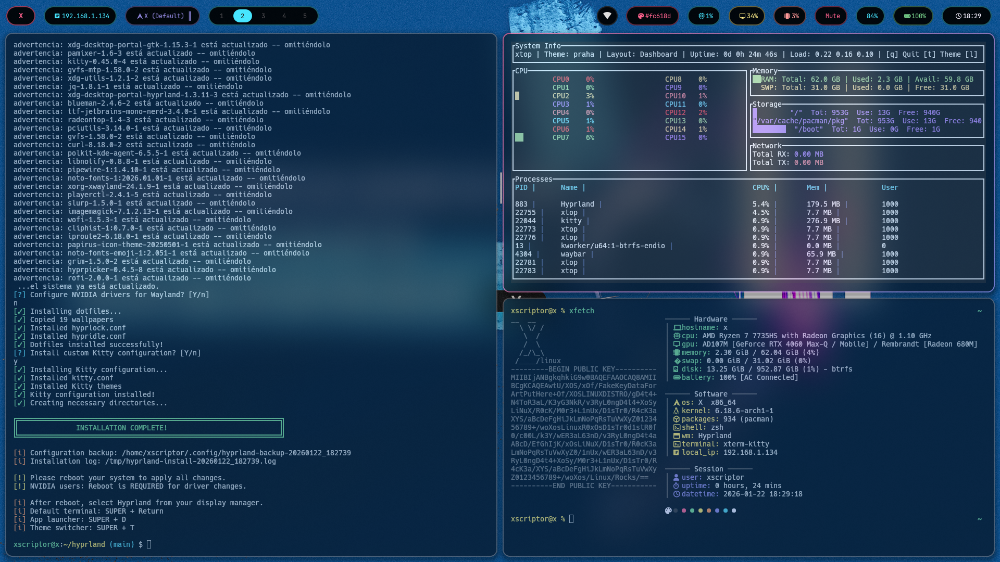
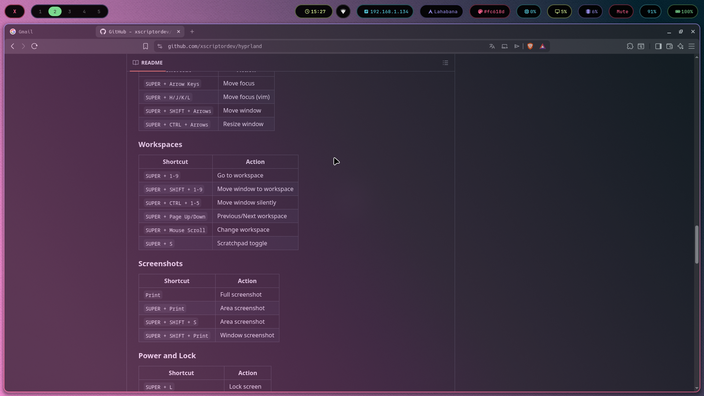
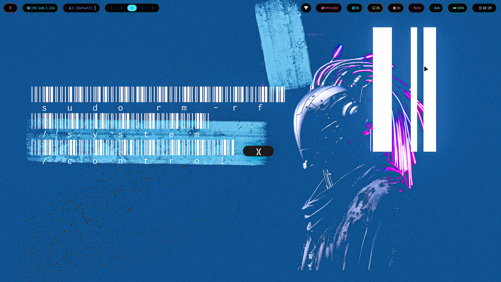
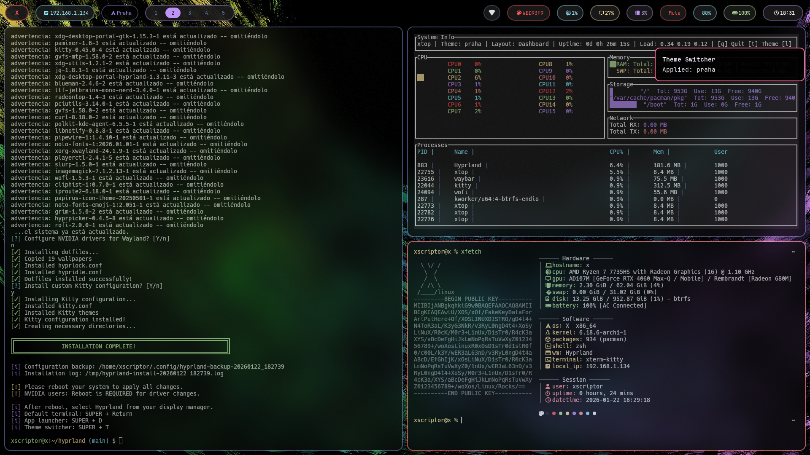

<h1 align="center"> Hyprland X Configuration</h1>

<div align="center">


**A premium, modern, and complete configuration for Hyprland**

*13 color schemes - Optimized NVIDIA support - Automated installation*

</div>

<p align="center"></p>

---


<h1 align="center"> Previews </h1>

<p align="center">
  <a href="./assets/previews/preview02.png">
    
  </a>
</p>

<details>
  <summary>More previews</summary>

  <table>
    <tr>
      <td align="center">
        <a href="./assets/previews/preview01.png">
          
        </a>
      </td>
      <td align="center">
        <a href="./assets/previews/preview03.png">
          
        </a>
      </td>
      <td align="center">
        <a href="./assets/previews/preview04.png">
          
        </a>
      </td>
    </tr>
  </table>
</details>

## Features

- **13 Color Themes** - From neon cyberpunk to elegant minimalism
- **NVIDIA Support** - Optimized configuration for RTX 4060 and other cards
- **Automated Installation** - Single command to configure everything
- **Premium Design** - Glassmorphism, smooth animations, and blur effects
- **Intuitive Keybindings** - GNOME/Windows style for easy transition
- **Hyprlock** - Lock screen with blur and themes
- **Modular** - Configuration split into files for easy customization

---

## Color Schemes

| Theme | Preview | Description |
|-------|---------|-------------|
| **X** | Purple/Pink/Green | Main theme with magenta accents |
| **Miami** | Black/Pink/Cyan | Cyberpunk/Retrowave |
| **Seul** | Black/Pink/Cyan | Asian neon |
| **Paris** | Black/Pink/Blue | Elegant pastel blue |
| **Tokio** | Brown/Orange/Purple | Warm orange accents |
| **Oslo** | Blue/Red/Green | Nordic blue |
| **Praha** | Black/Red/Purple | Dracula-inspired |
| **Bogota** | Black/Cyan/Green | Vibrant cyan |
| **Madrid** | Black/Red/Green | Intense Spanish red |
| **Lahabana** | Brown/Pink/Green | Tropical lime green |
| **Helsinki** | White/Teal/Purple | Light Nordic theme |
| **Berlin** | Black/White/White | Elegant monochrome |
| **London** | Black/Gray/Gray | Subtle grayscale |

---

## Requirements

### System
- **Distribution**: Arch Linux (or derivatives: EndeavourOS, Manjaro, CachyOS, etc.)
- **Kernel**: Linux 6.x+ recommended
- **RAM**: 4GB minimum, 8GB+ recommended

### GPU
| GPU | Status | Notes |
|-----|--------|-------|
| **NVIDIA RTX 40xx** | Supported | `nvidia-open-dkms` driver recommended |
| **NVIDIA RTX 30xx** | Supported | `nvidia-dkms` driver recommended |
| **NVIDIA RTX 20xx** | Supported | `nvidia-dkms` driver |
| **NVIDIA GTX 16xx/10xx** | Supported | `nvidia-dkms` driver |
| **AMD** | Supported | Open source drivers |
| **Intel** | Supported | Open source drivers |

---

## Installation

### Quick Install

```bash
git clone https://github.com/xscriptordev/hyprland.git
cd hyprland
chmod +x install.sh
./install.sh
```

### Dotfiles Only (no system changes)

```bash
./install.sh --dotfiles-only
```

### NVIDIA Configuration Only

```bash
./install.sh --nvidia-only
```

---

## Keybindings

### Applications
| Shortcut | Action |
|----------|--------|
| `SUPER + Return` | Terminal (Kitty) |
| `SUPER + T` | Terminal (Kitty) |
| `SUPER + Q` | Close window |
| `SUPER + SHIFT + Q` | Exit Hyprland |
| `SUPER + D` | App launcher (Rofi, fallback to Wofi) |
| `SUPER + R` | Run command (Rofi, fallback to Wofi) |
| `SUPER + E` | File manager (Nautilus) |
| `SUPER + B` | Browser (Firefox) |
| `SUPER + C` | Code editor (VSCode) |
| `SUPER + .` | Emoji picker |

### Window Management
| Shortcut | Action |
|----------|--------|
| `SUPER + V` | Toggle floating |
| `SUPER + Space` | Toggle floating |
| `SUPER + F` | Fullscreen |
| `SUPER + M` | Maximize |
| `SUPER + G` | Center window |
| `SUPER + SHIFT + Space` | Pin window |
| `SUPER + P` | Pseudo-tile |
| `SUPER + J` | Toggle split |
| `ALT + Tab` | Cycle windows |

### Focus and Movement
| Shortcut | Action |
|----------|--------|
| `SUPER + Arrow Keys` | Move focus |
| `SUPER + H/J/K/L` | Move focus (vim) |
| `SUPER + SHIFT + Arrows` | Move window |
| `SUPER + CTRL + Arrows` | Resize window |

### Workspaces
| Shortcut | Action |
|----------|--------|
| `SUPER + 1-9` | Go to workspace |
| `SUPER + SHIFT + 1-9` | Move window to workspace |
| `SUPER + CTRL + 1-5` | Move window silently |
| `SUPER + Page Up/Down` | Previous/Next workspace |
| `SUPER + Mouse Scroll` | Change workspace |
| `SUPER + S` | Scratchpad toggle |

### Screenshots
| Shortcut | Action |
|----------|--------|
| `Print` | Full screenshot |
| `SUPER + Print` | Area screenshot |
| `SUPER + SHIFT + S` | Area screenshot |
| `SUPER + SHIFT + Print` | Window screenshot |

### Power and Lock
| Shortcut | Action |
|----------|--------|
| `SUPER + L` | Lock screen |
| `SUPER + Escape` | Power menu (logout/reboot/shutdown/etc.) |
| `SUPER + SHIFT + L` | Power menu (wlogout) |
| `SUPER + CTRL + L` | Suspend |
| `SUPER + CTRL + SHIFT + L` | Shutdown |

### Brightness
| Shortcut | Action |
|----------|--------|
| `XF86MonBrightnessUp` | Brightness up |
| `XF86MonBrightnessDown` | Brightness down |
| `SUPER + F3` | Brightness up (fallback shortcut) |
| `SUPER + F2` | Brightness down (fallback shortcut) |

**Notes**
- Laptop/internal display: uses `brightnessctl`.
- External monitors: supports DDC/CI via `ddcutil` (may require enabling DDC/CI in the monitor OSD and I2C permissions).

### Utilities
| Shortcut | Action |
|----------|--------|
| `SUPER + ALT + T` | Theme switcher |
| `SUPER + W` | Wallpaper selector |
| `SUPER + Z` | Scale menu (75%/80%/100%) |
| `SUPER + SHIFT + C` | Color picker |
| `SUPER + SHIFT + V` | Clipboard history |
| `SUPER + N` | Show notification |
| `SUPER + SHIFT + N` | Clear notifications |
| `SUPER + SHIFT + B` | Reload Waybar |
| `SUPER + SHIFT + R` | Reload Hyprland |

### Volume (without media keys)
| Shortcut | Action |
|----------|--------|
| `SUPER + =` | Volume up |
| `SUPER + -` | Volume down |
| `SUPER + Backspace` | Mute |

---

## Structure

```
~/.config/
├── hypr/
│   ├── hyprland.conf    # Main config
│   ├── keybinds.conf    # Keybindings
│   ├── animations.conf  # Animations
│   ├── windowrules.conf # Window rules
│   ├── env.conf         # Variables (NVIDIA optimized)
│   ├── autostart.conf   # Startup apps
│   ├── theme.conf       # Current theme
│   ├── themes/          # All themes
│   ├── scripts/         # Helper scripts
│   └── wallpapers/      # Wallpapers
├── waybar/              # Status bar
├── wofi/                # App launcher
├── rofi/                # App launcher themes
├── wlogout/             # Logout menu (layout/style/icons)
└── dunst/               # Notifications
```

---

## Customization

### Change Theme
```bash
~/.config/hypr/scripts/theme-switcher.sh
# Or use: SUPER + ALT + T
```

### Change Wallpaper
```bash
~/.config/hypr/scripts/wallpaper.sh
# Or use: SUPER + W
```

### Modify Keybindings
Edit `~/.config/hypr/keybinds.conf`

### Add Autostart Apps
Edit `~/.config/hypr/autostart.conf`

---

## Troubleshooting

### NVIDIA: Black screen or flickering
1. Verify that `nvidia_drm.modeset=1` is in kernel params
2. Make sure to reboot after installing drivers
3. Check services: `systemctl status nvidia-suspend`

### Waybar not showing
```bash
killall waybar
waybar &
```

### Wofi not responding
```bash
killall wofi
```

### Hyprlock not working
Verify hyprlock is installed:
```bash
pacman -S hyprlock
```

---

## Credits

- Inspired by [ML4W Dotfiles](https://github.com/mylinuxforwork/dotfiles)
- [Hyprland](https://hyprland.org/) - The window manager
- Color schemes based on world cities

---

## License

(MIT License)[./LICENSE]

---

<div align="center">

**[X](https://github.com/xscriptordev)**

</div>
