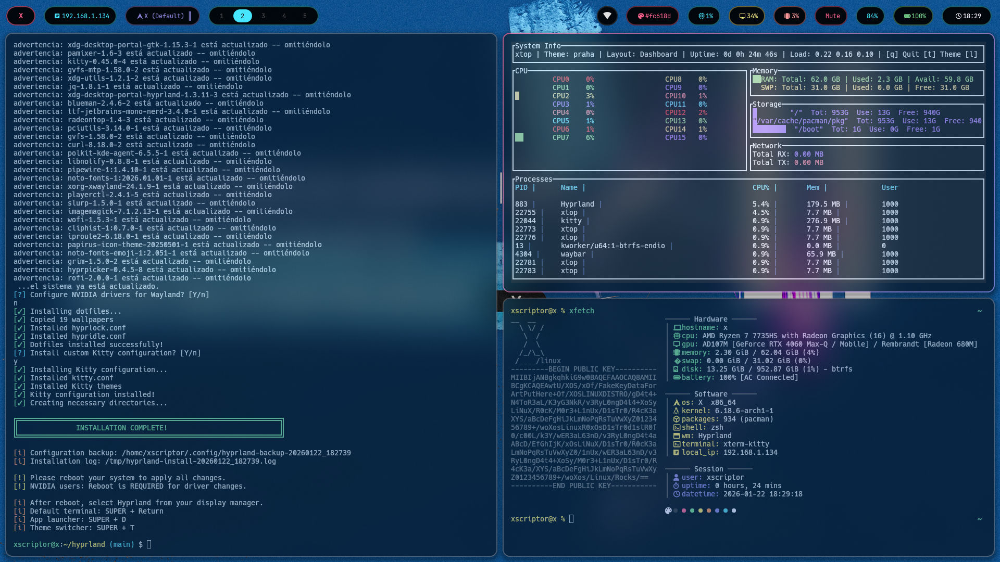
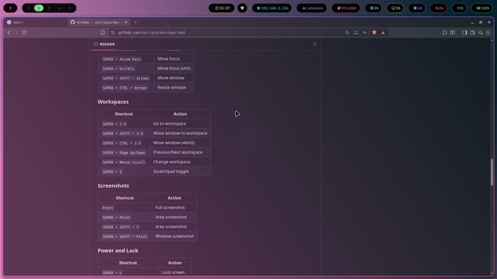
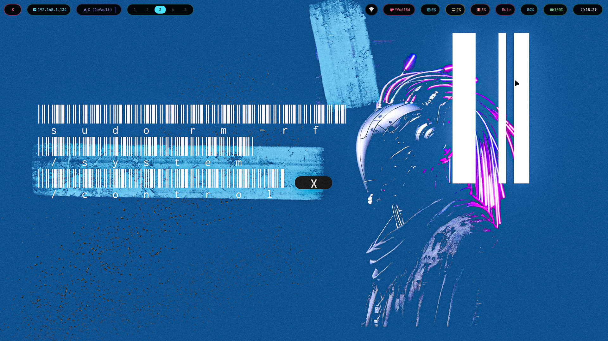
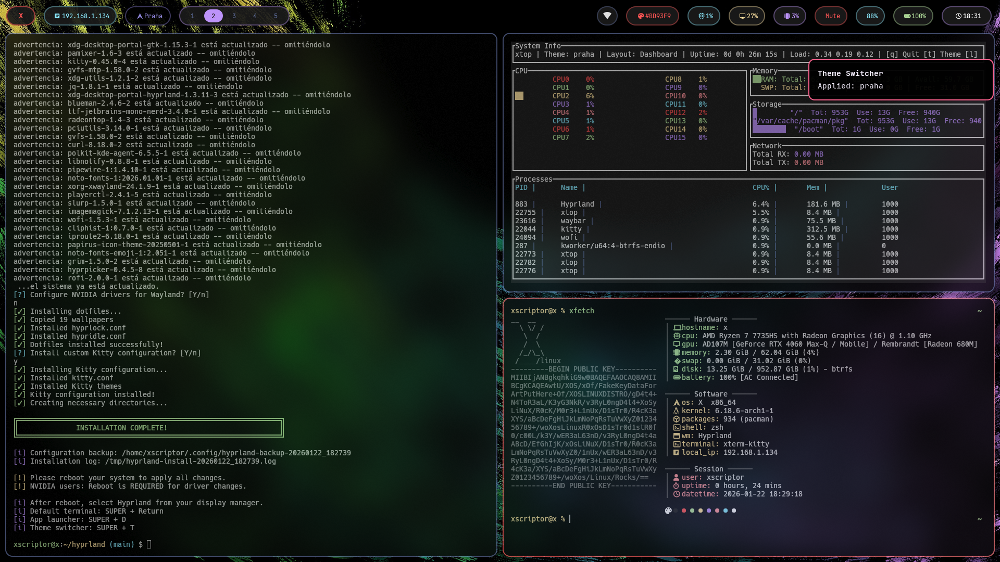

<h1 align="center"> Hyprland X Configuration</h1>

<div align="center">


    

<br>

**A premium, modern, and complete configuration for Hyprland**

*13 color schemes - Optimized NVIDIA support - Automated installation*

<br>


</div>

<br>
<hr>

<details open>
  <summary><h2>Table of Contents</h2></summary>
  <ul>
    <li><a href="#previews">Previews</a></li>
    <li><a href="#features">Features</a></li>
    <li><a href="#color-schemes">Color Schemes</a></li>
    <li><a href="#requirements">Requirements</a>
      <ul>
        <li><a href="#system">System</a></li>
        <li><a href="#gpu">GPU</a></li>
      </ul>
    </li>
    <li><a href="#installation">Installation</a></li>
    <li><a href="#keybindings">Keybindings</a></li>
    <li><a href="#structure">Structure</a></li>
    <li><a href="#customization">Customization</a></li>
    <li><a href="#troubleshooting">Troubleshooting</a></li>
    <li><a href="#related-documents">Related Documents</a></li>
  </ul>
</details>

<hr>
<br>

<h2 id="previews" align="center">Previews</h2>

<p align="center">
  <a href="./assets/previews/preview02.png">
    
  </a>
</p>

<details>
  <summary><b>Click to see more previews</b></summary>
  <br>
  <table align="center">
    <tr>
      <td align="center">
        <a href="./assets/previews/preview01.png">
          
        </a>
      </td>
      <td align="center">
        <a href="./assets/previews/preview03.png">
          
        </a>
      </td>
      <td align="center">
        <a href="./assets/previews/preview04.png">
          
        </a>
      </td>
    </tr>
  </table>
</details>

<br>

<h2 id="features">Features</h2>

<ul>
  <li><b>13 Color Themes</b> - From neon cyberpunk to elegant minimalism</li>
  <li><b>NVIDIA Support</b> - Optimized for RTX 50xx, 40xx, 30xx, 20xx, and GTX series</li>
  <li><b>GPU Performance Modes</b> - Switch between silent, normal, and turbo (NVIDIA)</li>
  <li><b>Multi-Monitor</b> - Per-monitor workspace binding, smart workspace transitions</li>
  <li><b>Monitor Manager</b> - Rofi menu to change layout, position, and refresh rate</li>
  <li><b>Automated Installation</b> - Single command to configure everything</li>
  <li><b>Premium Design</b> - Glassmorphism, smooth animations, and blur effects</li>
  <li><b>Intuitive Keybindings</b> - GNOME/Windows style for easy transition</li>
  <li><b>Smart Gaps</b> - Borders and gaps auto-hide with single window</li>
  <li><b>Named Scratchpads</b> - Quick-toggle terminal, files, and music</li>
  <li><b>Hyprlock</b> - Lock screen with blur and themes</li>
  <li><b>Modular</b> - Configuration split into files for easy customization</li>
</ul>

<hr>

<h2 id="color-schemes">Color Schemes</h2>

<table align="center">
  <thead>
    <tr>
      <th>Theme</th>
      <th>Preview</th>
      <th>Description</th>
    </tr>
  </thead>
  <tbody>
    <tr>
      <td><b>X</b></td>
      <td>Purple / Pink / Green</td>
      <td>Main theme with magenta accents</td>
    </tr>
    <tr>
      <td><b>Miami</b></td>
      <td>Black / Pink / Cyan</td>
      <td>Cyberpunk / Retrowave</td>
    </tr>
    <tr>
      <td><b>Seul</b></td>
      <td>Black / Pink / Cyan</td>
      <td>Asian neon</td>
    </tr>
    <tr>
      <td><b>Paris</b></td>
      <td>Black / Pink / Blue</td>
      <td>Elegant pastel blue</td>
    </tr>
    <tr>
      <td><b>Tokio</b></td>
      <td>Brown / Orange / Purple</td>
      <td>Warm orange accents</td>
    </tr>
    <tr>
      <td><b>Oslo</b></td>
      <td>Blue / Red / Green</td>
      <td>Nordic blue</td>
    </tr>
    <tr>
      <td><b>Praha</b></td>
      <td>Black / Red / Purple</td>
      <td>Dracula-inspired</td>
    </tr>
    <tr>
      <td><b>Bogota</b></td>
      <td>Black / Cyan / Green</td>
      <td>Vibrant cyan</td>
    </tr>
    <tr>
      <td><b>Madrid</b></td>
      <td>Black / Red / Green</td>
      <td>Intense Spanish red</td>
    </tr>
    <tr>
      <td><b>Lahabana</b></td>
      <td>Brown / Pink / Green</td>
      <td>Tropical lime green</td>
    </tr>
    <tr>
      <td><b>Helsinki</b></td>
      <td>White / Teal / Purple</td>
      <td>Light Nordic theme</td>
    </tr>
    <tr>
      <td><b>Berlin</b></td>
      <td>Black / White / White</td>
      <td>Elegant monochrome</td>
    </tr>
    <tr>
      <td><b>London</b></td>
      <td>Black / Gray / Gray</td>
      <td>Subtle grayscale</td>
    </tr>
  </tbody>
</table>

<hr>

<h2 id="requirements">Requirements</h2>

<h3 id="system">System</h3>
<ul>
  <li><b>Distribution</b>: Arch Linux (or derivatives: EndeavourOS, Manjaro, CachyOS, etc.)</li>
  <li><b>Kernel</b>: Linux 6.x+ recommended</li>
  <li><b>RAM</b>: 4GB minimum, 8GB+ recommended</li>
</ul>

<h3 id="gpu">GPU</h3>
<table>
  <thead>
    <tr>
      <th>GPU</th>
      <th>Status</th>
      <th>Notes</th>
    </tr>
  </thead>
  <tbody>
    <tr><td><b>NVIDIA RTX 50xx</b></td><td>Supported</td><td><code>nvidia-dkms</code> driver recommended</td></tr>
    <tr><td><b>NVIDIA RTX 40xx</b></td><td>Supported</td><td><code>nvidia-dkms</code> driver recommended</td></tr>
    <tr><td><b>NVIDIA RTX 30xx</b></td><td>Supported</td><td><code>nvidia-dkms</code> driver recommended</td></tr>
    <tr><td><b>NVIDIA RTX 20xx</b></td><td>Supported</td><td><code>nvidia-dkms</code> driver</td></tr>
    <tr><td><b>NVIDIA GTX 16xx/10xx</b></td><td>Supported</td><td><code>nvidia-dkms</code> driver</td></tr>
    <tr><td><b>AMD</b></td><td>Supported</td><td>Open source drivers</td></tr>
    <tr><td><b>Intel</b></td><td>Supported</td><td>Open source drivers</td></tr>
  </tbody>
</table>

<hr>

<h2 id="installation">Installation</h2>

<h3>Quick Install</h3>

```bash
git clone https://github.com/xscriptor/hyprland.git
cd hyprland
chmod +x install.sh
./install.sh
```

<h3>Dotfiles Only (no system changes)</h3>

```bash
./install.sh --dotfiles-only
```

<h3>NVIDIA Configuration Only</h3>

```bash
./install.sh --nvidia-only
```

<hr>

<h2 id="keybindings">Keybindings</h2>

<details>
  <summary><b>Applications</b></summary>
  <br>
  <table>
    <tr><th>Shortcut</th><th>Action</th></tr>
    <tr><td><code>SUPER + Return</code></td><td>Terminal (Kitty)</td></tr>
    <tr><td><code>SUPER + T</code></td><td>Terminal (Kitty)</td></tr>
    <tr><td><code>SUPER + Q</code></td><td>Close window</td></tr>
    <tr><td><code>SUPER + SHIFT + Q</code></td><td>Exit Hyprland</td></tr>
    <tr><td><code>SUPER + D</code></td><td>App launcher (Rofi)</td></tr>
    <tr><td><code>SUPER + R</code></td><td>Run command (Rofi)</td></tr>
    <tr><td><code>SUPER + E</code></td><td>File manager (Nautilus)</td></tr>
    <tr><td><code>SUPER + B</code></td><td>Browser (Firefox)</td></tr>
    <tr><td><code>SUPER + C</code></td><td>Code editor (VSCode)</td></tr>
    <tr><td><code>SUPER + .</code></td><td>Emoji picker</td></tr>
  </table>
</details>

<details>
  <summary><b>Window Management</b></summary>
  <br>
  <table>
    <tr><th>Shortcut</th><th>Action</th></tr>
    <tr><td><code>SUPER + V</code></td><td>Toggle floating</td></tr>
    <tr><td><code>SUPER + Space</code></td><td>Toggle floating</td></tr>
    <tr><td><code>SUPER + F</code></td><td>Fullscreen</td></tr>
    <tr><td><code>SUPER + M</code></td><td>Maximize</td></tr>
    <tr><td><code>SUPER + G</code></td><td>Center window</td></tr>
    <tr><td><code>SUPER + SHIFT + Space</code></td><td>Pin window</td></tr>
    <tr><td><code>SUPER + P</code></td><td>Pseudo-tile</td></tr>
    <tr><td><code>SUPER + J</code></td><td>Toggle split</td></tr>
    <tr><td><code>ALT + Tab</code></td><td>Cycle windows (bring to top)</td></tr>
  </table>
</details>

<details>
  <summary><b>Focus and Movement</b></summary>
  <br>
  <table>
    <tr><th>Shortcut</th><th>Action</th></tr>
    <tr><td><code>SUPER + Arrow Keys</code></td><td>Move focus</td></tr>
    <tr><td><code>SUPER + H/J/K/L</code></td><td>Move focus (vim)</td></tr>
    <tr><td><code>SUPER + SHIFT + Arrows</code></td><td>Move window</td></tr>
    <tr><td><code>SUPER + CTRL + Arrows</code></td><td>Resize window</td></tr>
  </table>
</details>

<details>
  <summary><b>Workspaces & Scratchpads</b></summary>
  <br>
  <table>
    <tr><th>Shortcut</th><th>Action</th></tr>
    <tr><td><code>SUPER + 1-9,0</code></td><td>Go to workspace 1-10</td></tr>
    <tr><td><code>SUPER + SHIFT + 1-9,0</code></td><td>Move window to workspace</td></tr>
    <tr><td><code>SUPER + CTRL + 1-9,0</code></td><td>Move window silently (stay on current)</td></tr>
    <tr><td><code>SUPER + Page Up/Down</code></td><td>Previous/Next workspace</td></tr>
    <tr><td><code>SUPER + Mouse Scroll</code></td><td>Change workspace</td></tr>
    <tr><td><code>SUPER + Tab</code></td><td>Previous workspace (stays on current monitor)</td></tr>
    <tr><td><code>SUPER + S</code></td><td>Toggle terminal scratchpad</td></tr>
    <tr><td><code>SUPER + SHIFT + S</code></td><td>Move window to terminal scratchpad</td></tr>
    <tr><td><code>SUPER + A</code></td><td>Toggle file manager scratchpad</td></tr>
    <tr><td><code>SUPER + SHIFT + A</code></td><td>Move window to file manager scratchpad</td></tr>
  </table>
</details>

<details>
  <summary><b>Multi-Monitor</b></summary>
  <br>
  <table>
    <tr><th>Shortcut</th><th>Action</th></tr>
    <tr><td><code>SUPER + ALT + I</code></td><td>Focus next monitor</td></tr>
    <tr><td><code>SUPER + ALT + U</code></td><td>Focus previous monitor</td></tr>
    <tr><td><code>SUPER + ALT + SHIFT + I</code></td><td>Move window to next monitor</td></tr>
    <tr><td><code>SUPER + ALT + SHIFT + U</code></td><td>Move window to previous monitor</td></tr>
    <tr><td><code>SUPER + ALT + O</code></td><td>Swap workspaces between monitors</td></tr>
    <tr><td><code>SUPER + ALT + P</code></td><td>Move workspace to next monitor</td></tr>
    <tr><td><code>SUPER + ALT + M</code></td><td>Monitor manager (position/frequency)</td></tr>
    <tr><td><code>SUPER + ALT + SHIFT + M</code></td><td>Show monitor info</td></tr>
  </table>
</details>

<details>
  <summary><b>GPU / Power / Media / Utils</b></summary>
  <br>
  <h4>GPU Performance (NVIDIA)</h4>
  <table>
    <tr><td><code>SUPER + ALT + G</code></td><td>Cycle GPU mode: silent / normal / turbo</td></tr>
    <tr><td><code>SUPER + ALT + SHIFT + G</code></td><td>Open GPU mode selector (Rofi)</td></tr>
  </table>
  
  <h4>Screenshots</h4>
  <table>
    <tr><td><code>Print</code></td><td>Full screenshot</td></tr>
    <tr><td><code>SUPER + Print</code></td><td>Area screenshot</td></tr>
    <tr><td><code>SUPER + SHIFT + S</code></td><td>Area screenshot</td></tr>
    <tr><td><code>SUPER + SHIFT + Print</code></td><td>Window screenshot</td></tr>
  </table>

  <h4>Power and Lock</h4>
  <table>
    <tr><td><code>SUPER + L</code></td><td>Lock screen</td></tr>
    <tr><td><code>SUPER + Escape</code></td><td>Power menu</td></tr>
    <tr><td><code>SUPER + SHIFT + L</code></td><td>Power menu (wlogout)</td></tr>
    <tr><td><code>SUPER + CTRL + L</code></td><td>Suspend</td></tr>
    <tr><td><code>SUPER + CTRL + SHIFT + L</code></td><td>Shutdown</td></tr>
  </table>

  <h4>Brightness</h4>
  <table>
    <tr><td><code>XF86MonBrightnessUp</code></td><td>Brightness up</td></tr>
    <tr><td><code>XF86MonBrightnessDown</code></td><td>Brightness down</td></tr>
    <tr><td><code>SUPER + F3</code></td><td>Brightness up (fallback)</td></tr>
    <tr><td><code>SUPER + F2</code></td><td>Brightness down (fallback)</td></tr>
  </table>
  <p><em>Note: Internal display uses brightnessctl. External monitors use ddcutil.</em></p>

  <h4>Volume (without media keys)</h4>
  <table>
    <tr><td><code>SUPER + =</code></td><td>Volume up</td></tr>
    <tr><td><code>SUPER + -</code></td><td>Volume down</td></tr>
    <tr><td><code>SUPER + Backspace</code></td><td>Mute</td></tr>
  </table>

  <h4>Utilities</h4>
  <table>
    <tr><td><code>SUPER + ALT + T</code></td><td>Theme switcher</td></tr>
    <tr><td><code>SUPER + W</code></td><td>Wallpaper selector</td></tr>
    <tr><td><code>SUPER + Z</code></td><td>Scale menu (75%/80%/100%)</td></tr>
    <tr><td><code>SUPER + SHIFT + C</code></td><td>Color picker</td></tr>
    <tr><td><code>SUPER + SHIFT + V</code></td><td>Clipboard history</td></tr>
    <tr><td><code>SUPER + N</code></td><td>Show notification</td></tr>
    <tr><td><code>SUPER + SHIFT + N</code></td><td>Clear notifications</td></tr>
    <tr><td><code>SUPER + SHIFT + B</code></td><td>Reload Waybar</td></tr>
    <tr><td><code>SUPER + SHIFT + R</code></td><td>Reload Hyprland</td></tr>
  </table>
</details>

<hr>

<h2 id="structure">Structure</h2>

```text
~/.config/
├── hypr/
│   ├── hyprland.conf    # Main config
│   ├── keybinds.conf    # Keybindings
│   ├── animations.conf  # Animations
│   ├── windowrules.conf # Window rules
│   ├── workspaces.conf  # Workspace rules & multi-monitor
│   ├── env.conf         # Variables (NVIDIA optimized)
│   ├── autostart.conf   # Startup apps
│   ├── theme.conf       # Current theme
│   ├── themes/          # All themes
│   ├── scripts/         # Helper scripts
│   └── wallpapers/      # Wallpapers
├── waybar/              # Status bar
├── rofi/                # App launcher themes
├── wlogout/             # Logout menu (layout/style/icons)
└── dunst/               # Notifications
```

<hr>

<h2 id="customization">Customization</h2>

<details>
  <summary><b>Change Theme & Wallpaper</b></summary>
  <br>
  <p><strong>Change Theme:</strong></p>
  <pre><code>~/.config/hypr/scripts/theme-switcher.sh
# Or use: SUPER + ALT + T</code></pre>
  
  <p><strong>Change Wallpaper:</strong></p>
  <pre><code>~/.config/hypr/scripts/wallpaper.sh
# Or use: SUPER + W</code></pre>
</details>

<details>
  <summary><b>Modify Configurations</b></summary>
  <br>
  <ul>
    <li><b>Modify Keybindings:</b> Edit <code>~/.config/hypr/keybinds.conf</code></li>
    <li><b>Add Autostart Apps:</b> Edit <code>~/.config/hypr/autostart.conf</code></li>
  </ul>
</details>

<details>
  <summary><b>Multi-Monitor Setup</b></summary>
  <br>
  <ol>
    <li>Connect your external monitor.</li>
    <li>Identify your monitors: <code>hyprctl monitors all</code></li>
    <li>Edit <code>~/.config/hypr/hyprland.conf</code> — uncomment and adjust the monitor lines.</li>
    <li>Edit <code>~/.config/hypr/workspaces.conf</code> — uncomment the workspace bindings and replace the <code>desc:</code> values with your monitor descriptions.</li>
    <li>Reload: <code>SUPER + SHIFT + R</code></li>
  </ol>
  <p><b>Example for laptop (eDP-1) + external (HDMI-A-1):</b></p>
  <pre><code># hyprland.conf
monitor = eDP-1, preferred, 0x0, 1
monitor = HDMI-A-1, 1920x1080@60, 1920x0, 1

# workspaces.conf
workspace = 1, monitor:desc:BOE 0x0BCA (eDP-1), default:true
workspace = 6, monitor:desc:Samsung Electric Company ... (HDMI-A-1), default:true</code></pre>
</details>

<details>
  <summary><b>GPU Optimus Modes (EnvyControl)</b></summary>
  <br>
  <p>Safely switch between three graphics modes using <code>envycontrol</code> for NVIDIA Optimus laptops:</p>
  <table>
    <tr><th>Mode</th><th>Effect</th><th>Use Case</th></tr>
    <tr><td><b>Integrated</b></td><td>NVIDIA completely powered off</td><td>Maximum battery life, coding, browsing</td></tr>
    <tr><td><b>Hybrid</b></td><td>Intel/AMD drives display, NVIDIA offloads</td><td>Balanced everyday use (Default)</td></tr>
    <tr><td><b>NVIDIA</b></td><td>NVIDIA drives everything</td><td>Gaming, rendering, external monitors</td></tr>
  </table>
  <blockquote><strong>Note:</strong> Changing modes requires a <strong>reboot</strong> or logging out to take effect.</blockquote>
  <p><b>Control options:</b></p>
  <ul>
    <li><b>Waybar</b>: Click the GPU mode indicator to cycle, right-click for menu</li>
    <li><b>Rofi menu</b>: <code>SUPER + ALT + SHIFT + G</code></li>
    <li><b>Keybind</b>: <code>SUPER + ALT + G</code> to cycle modes</li>
    <li><b>Terminal</b>: <code>~/.config/hypr/scripts/gpu-mode.sh [integrated|hybrid|nvidia]</code></li>
  </ul>
</details>

<details>
  <summary><b>Monitor Management</b></summary>
  <br>
  <p>Manage monitor position, layout, and refresh rate with a Rofi menu:</p>
  <ul>
    <li><b>Layout</b>: External on right / left / above / below</li>
    <li><b>Mirror</b>: Mirror both displays</li>
    <li><b>Single</b>: Only primary / only external</li>
    <li><b>Refresh Rate</b>: 60 / 90 / 120 / 144 / 165 / 240 Hz</li>
  </ul>
  <p><b>Control options:</b></p>
  <ul>
    <li><b>Keybind</b>: <code>SUPER + ALT + M</code> to open menu</li>
    <li><b>Info</b>: <code>SUPER + ALT + SHIFT + M</code> to show current monitor details</li>
  </ul>
</details>

<hr>

<h2 id="troubleshooting">Troubleshooting</h2>

<details>
  <summary><b>NVIDIA: Black screen or flickering</b></summary>
  <br>
  <ol>
    <li>Verify that <code>nvidia_drm.modeset=1</code> is in kernel params.</li>
    <li>Make sure to reboot after installing drivers.</li>
    <li>Check services: <code>systemctl status nvidia-suspend</code></li>
  </ol>
</details>

<details>
  <summary><b>Waybar not showing</b></summary>
  <br>
  <pre><code>killall waybar
waybar &</code></pre>
</details>

<details>
  <summary><b>Rofi not responding</b></summary>
  <br>
  <pre><code>killall rofi</code></pre>
</details>

<details>
  <summary><b>Hyprlock not working</b></summary>
  <br>
  <p>Verify hyprlock is installed:</p>
  <pre><code>pacman -S hyprlock</code></pre>
</details>

<hr>


<h2 id="related-documents">Related Documents</h2>

<ul>
  <li><a href="./LICENSE">License</a></li>
  <li><a href="./CODE_OF_CONDUCT.md">Code of Conduct</a></li>
  <li><a href="./CONTRIBUTING.md">Contributions</a></li>
  <li><a href="./ROADMAP.md">Roadmap</a></li>
  <li><a href="https://github.com/xscriptor">X Profile</a></li>
  <li><a href="https://dev.xscriptor.com">Website</a></li>
</ul>
